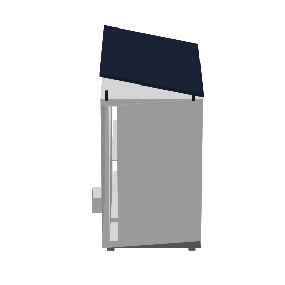

# HarvestGuard: models and trust rail

Open engineering models for solar-powered cold storage serving smallholder horticulture, and the
payment-and-record layer that runs on top of them. The sizing engine is site-parametric: it solves
array and battery for any location from its own climatology. It has been run over **33 regions in
20 African countries** and **six regions in Vietnam**, and both results are in this repository.

Everything is reproducible offline. Climatology is cached, so the same input returns the same
number on any machine, and every figure quoted below regenerates from the commands in
[Running it](#running-it).

<p align="center">
  
</p>
<p align="center"><sub>1.5 m³ · 40 crate slots · R290 (GWP 3) · off-grid · payment-gated door<br>
White polyurethane panel, monocrystalline module, galvanised steel frame.<br>
Rendered from <code>cad/harvestguard_pod.stl</code>; regenerate with <code>make_turntable.py</code>.</sub></p>

> **Status.** These are design and validation models. **No physical pod has been built.**
> Every figure below is what the physics says should happen; none of it is a field measurement.
> Each write-up ends with an explicit boundaries section stating what its model cannot support.

---

## `sim/`: the engineering models

**Continental and national sizing**

| Module | What it does |
|---|---|
| `africa_sizing_engine.py` | Solves array and battery for any site, then partitions **33 African regions across 20 countries** into a minimal SKU set by exact dynamic program |
| `vietnam_sizing.py` | Runs the same engine over **six Vietnamese horticulture regions**, on both the ambient (13 °C) and cool (6 °C) hold programmes |
| `fetch_africa_sites.py` | Fetches and caches NASA POWER climatology for any site |

**Thermal and energy models**

| Module | What it does |
|---|---|
| `ghana_energy_model.py` | Steady-state monthly energy balance: PV supply against conduction, infiltration, produce pull-down and respiration, with a condition-dependent COP |
| `ho_dynamic_sim.py` | 8,784-hour dynamic run on real hourly weather, integrating box temperature and battery state of charge as coupled states |
| `pod_thermal_3d.py` | 8,925-cell finite-volume model of the pod interior, backward Euler on a prefactorised sparse operator |
| `pod_loading_policy.py` | How much field-hot produce the pod can absorb per cycle |
| `ghana_sensitivity.py` | Swings eight assumptions independently and reports whether the conclusion survives |
| `ghana_circularity.py` | Material loop and emissions, with an internal consistency check |
| `africa_atlas.py`, `pod_thermal_figure.py` | Figures |

**Write-ups:** `GHANA_SITE_TRANSFER.md`, `DYNAMIC_VALIDATION.md`, `THERMAL_3D.md`, `AFRICA_DEPLOYMENT.md`

### Four findings worth reading

**Africa: a pod sized for one site fails at another.** Moved unchanged from an East African
highland baseline to Ho, Volta Region, the design runs an energy deficit in all twelve months,
worst case −442 Wh/day. Ho has 21% less solar resource against a 9.1 K hotter mean, so supply
falls and demand rises together. Eight assumptions swung independently; **0 of 8 flip it.**

**Both regions: stratification, not the average, sets the setpoint.** The 3D interior model finds a 2.47 K
spread from the evaporator to the floor. Against an assumed chilling-injury floor of 10 °C, a
13 °C setpoint leaves the coldest crate 0.85 K clear; at 11 °C, **10 of 36 crates would be damaged
while the thermostat still reads acceptable.** A lumped model sees only the average and would
permit the lower setpoint.

**Open work: the 10 °C chilling floor is the weakest input in the whole model.** It is applied
uniformly across the solanaceous programme, but the published requirements do not agree with each
other: garden egg is held at 14 to 16 °C for quality, bell pepper nearer 7.5 °C, mature green
tomato 12.5 to 15 °C and ripe tomato 7 to 10 °C. The programme groups those crops because they are
botanically related, which is the wrong basis for grouping them. A single floor also ignores
maturity stage, which for tomato moves the requirement by several kelvin on its own. The setpoint,
the array sizing and the SKU partition all inherit this assumption, so it is being checked with
postharvest specialists before any of those numbers are treated as settled.

**Vietnam: uniform where Africa is not, which is the whole market-entry case.** Running the same
engine over six Vietnamese regions from Đà Lạt to Cần Thơ, the ambient hold needs 290 W to 400 W,
a 1.4-fold range against 3.7-fold across Africa. Every Vietnamese site clears a configuration the
African partition already produced, so entering the market needs no new hardware. **The cool hold
does not.** The 6 °C programme Đà Lạt's temperate vegetables require needs 450 W to 580 W and
exceeds the largest existing configuration at all six sites, which is a gap this repository states
rather than hides. Reproduce with `python3 sim/vietnam_sizing.py`.

**One design cannot travel.** Across 33 regions in 20 countries the required array spans 120 W to
440 W, a 3.7-fold range. An exact dynamic program partitions that into three configurations covering
every region.

## `services/ledger/`: the trust rail

Signed pod events, a tamper-evident ledger, mobile-money settlement, and the farmer credit record
built from them. **28 passing tests.**

Three properties every record carries, because a lender needs all three:

| Property | Mechanism |
|---|---|
| A specific pod produced it | per-device HMAC-SHA256 over a canonical form |
| It has not been altered since | SHA-256 hash chain, each record committing to the previous |
| The money it claims moved actually moved | settlement callback confirmed before the record counts |

The credit profile is **not** a regulated credit score, does not predict default, and has never
been validated against repayment outcomes, because no loans have been written against it.

<a name="running-it"></a>

## Running it

```bash
git clone https://github.com/dayeon603-pixel/harvestguard-models.git
cd harvestguard-models
pip install -r requirements.txt

python3 sim/ghana_energy_model.py
python3 sim/ho_dynamic_sim.py
python3 sim/pod_thermal_3d.py
python3 sim/africa_sizing_engine.py

cd services/ledger
python3 -m pytest -q
PYTHONPATH=src python3 demo_season.py
```

| Command | What it prints |
|---|---|
| `ghana_energy_model.py` | Steady-state monthly balance, and the minimum array that closes every month |
| `ho_dynamic_sim.py` | 8,784-hour run on real Ho weather: in-band %, brownout hours, worst week |
| `pod_thermal_3d.py` | Interior field, stratification spread, crates below the assumed floor |
| `africa_sizing_engine.py` | 33 African regions sized, then partitioned into three SKUs |
| `vietnam_sizing.py` | Six Vietnamese regions, ambient and cool hold, against the existing SKUs |
| `pytest -q` | 28 tests over the ledger |
| `demo_season.py` | Six months end to end, ending in the tamper test |

The commands carry no inline comments on purpose, so the block survives a paste into shells
that do not treat `#` as a comment interactively. Every path is relative to the repo root, and
the last two commands run from `services/ledger`.

The demo runs a season of traffic through the live API, then tampers with a historical record to
show the chain detecting it and the service refusing to issue credit against unverified history.

## Data

NASA POWER (NASA Langley Research Center). Monthly climatology for 33 African sites under
`sim/data/africa/` and six Vietnamese sites under `sim/data/vietnam/`, plus full-year 2024 hourly
data for Ho under `sim/data/hourly/`. All cached, so every figure reproduces offline and a given
input always returns the same number. Country geometry from Natural Earth.

The Vietnamese sites are Đà Lạt (Lâm Đồng), Buôn Ma Thuột (Đắk Lắk), Mộc Châu (Sơn La),
Cần Thơ, Mỹ Tho (Tiền Giang) and Phan Thiết (Bình Thuận), chosen for smallholder horticulture
density across the country's agro-ecological range rather than by population.

## Licence

MIT. The sizing engine is offered as an open method: if it is useful for siting cold storage
anywhere, use it.
